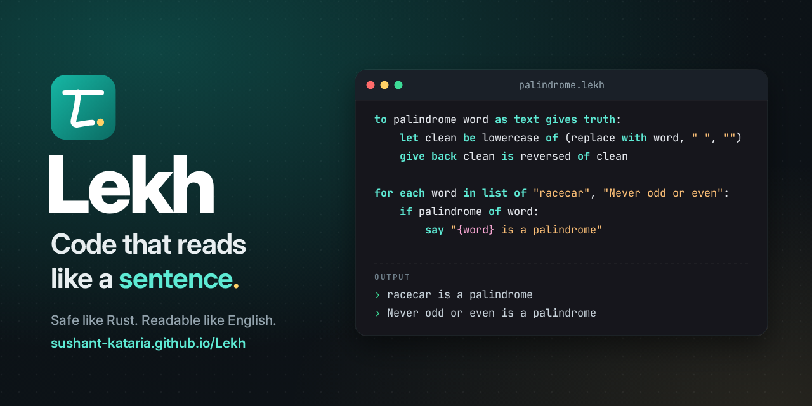

<p align="center">
  <a href="https://sushant-kataria.github.io/Lekh/"></a>
</p>

<p align="center">
  <a href="https://sushant-kataria.github.io/Lekh/"><b>🌐 Website</b></a> ·
  <a href="docs/guide/README.md">Guide</a> ·
  <a href="docs/reference.md">Reference</a> ·
  <a href="docs/cheatsheet.md">Cheat sheet</a> ·
  <a href="examples/">Examples</a>
</p>

# Lekh

**A programming language that reads like English and is safe like Rust.**

*Lekh* (लेख) means "a piece of writing" in Hindi and Sanskrit. Programs read
like instructions written for a person, and Lekh checks them for the bugs that
cause most crashes before they run.

```lekh
record Item:
    name as text
    price as number

let cart be list of (Item with name "chai", price 20), (Item with name "samosa", price 15), (Item with name "lassi", price 40)
let total be combine each i in cart into sum starting at 0 using sum + i's price
let cheap be keep each i in cart where i's price is less than 30
say "Total: ₹{total}"
say "Cheap: {join with (turn each i in cheap into i's name), ", "}"

let prices be map of "chai" to 20
when prices at "coffee":
    is some p: say "coffee costs {p}"
    is nothing: say "no coffee here"
```

```output
Total: ₹75
Cheap: chai, samosa
no coffee here
```

## Why Lekh?

* **Reads like English.** `let`, `say`, `for each`, `if ... is at least ...`,
  `give back`. There are very few symbols to learn.
* **No null crashes.** A missing value is a `maybe` you have to check.
* **No ignored errors.** Work that can fail gives a `result`; `try` passes problems along.
* **Ownership without the pain.** Every list has one owner, and you pass
  values with three words: look (the default), `lend`, `give`.
* **Safe concurrency.** `at the same time` blocks can't change shared data, so data races are impossible.
* **Errors that teach.** Every error gives the line, a plain-English
  explanation and a fix you can copy. Lekh even recognises `print`, `null` and `else` from other languages.
* **Batteries included.** 128 built-in tasks: files, JSON, dates, regex,
  HTTP, shell-free commands, maths, sets and more.
* **Real tooling.** `lekh test`, `lekh format`, `lekh new`, a REPL, and
  `lekh build`, which translates to Python and runs about 17x faster.

Here is what an error looks like:

```lekh error
let changeable names be list of "Asha", "Ravi"
let team be names
add "Mira" to names
```

```output

-- Lekh: Ownership rule ----------------------------------------------
In sample_2.lekh, line 3:

    3 | add "Mira" to names

`names` can't be used here because it was given away on line 2 (moved into `team`). Each list, map or record has exactly one owner at a time.

How to fix:
    If you still need `names`, give away a copy on line 2 instead:
        copy of names
```

## Quick start

You need Python 3.8 or newer, and nothing else.

```bash
git clone https://github.com/sushant-kataria/Lekh.git
cd Lekh
python3 lekh.py run examples/hello.lekh
python3 lekh.py repl
```

Make it a command with `alias lekh="python3 $PWD/lekh.py"` (Linux/macOS), then:

```bash
lekh new my_app && cd my_app
lekh run        # runs src/main.lekh
lekh test       # runs tests/
```

## Documentation

| | |
|---|---|
| 🌐 [**Website**](https://sushant-kataria.github.io/Lekh/) | all of this as a website, built by a Lekh program ([site/](site/build.lekh)) |
| 📘 [**Guide**](docs/guide/README.md) | a beginner tutorial in 15 short chapters, from install to a real program |
| 📗 [**Reference**](docs/reference.md) | every keyword, type, operator and built-in task, each with an example |
| 🛡️ [**Safety**](docs/safety.md) | ownership, borrowing, maybe and result explained simply |
| 📝 [**Cheat sheet**](docs/cheatsheet.md) | the whole language on one page |
| 🗺️ [**Roadmap**](docs/roadmap.md) | what's done, what's planned, and what web servers, UIs, databases and a compiler would need |
| 🧠 [**Design notes**](DESIGN.md) | why Lekh looks the way it does, and how it's built |

Every code sample in this README and in `docs/` is run by the test suite, and
every output shown is real.

## A taste of the language

```lekh
-- tasks, with optional type labels that are checked before running
to grade marks as number gives text:
    give back if marks is at least 60 then "pass" otherwise "try again"

-- choices and exhaustive pattern matching
choice Shape:
    Circle with radius as number
    Square with side as number

to area s as Shape gives number:
    when s:
        is Circle with r: give back round with 3.14159 * r * r, 2
        is Square with side: give back side * side

-- errors as values, passed along with `try`
to parse_age t as text gives result of number or text:
    let n be try (t as number)
    if n is less than 0: give back problem "age can't be negative"
    give back ok n

say grade of 72
say area of (Circle with radius 2)
for each t in list of "31", "abc":
    when parse_age of t:
        is ok age: say "age {age}"
        is problem why: say "error: {why}"

-- safe concurrency: results come back through a channel
let results be a new channel
for each n in list of 1, 2, 3 at the same time:
    send n * n to results
close results
let changeable squares be empty list
for each s in results:
    add s to squares
say sorted of squares
```

```output
pass
12.57
age 31
error: "abc" is not a number
[1, 4, 9]
```

## Examples

The [`examples/`](examples) folder has 18 programs. The larger ones:

| Program | Shows |
|---|---|
| [`todo_cli.lekh`](examples/todo_cli.lekh) | a to-do app stored in JSON; arguments, custom errors, methods |
| [`web_fetcher.lekh`](examples/web_fetcher.lekh) | fetching many pages at the same time; channels, regex, timing |
| [`text_adventure.lekh`](examples/text_adventure.lekh) | an interactive game; choices, guards, sets, `lend` |
| [`inventory_billing.lekh`](examples/inventory_billing.lekh) | GST invoices with abilities, generics and stock errors |
| [`csv_report.lekh`](examples/csv_report.lekh) | reading a CSV, skipping bad rows, a revenue report, JSON output |
| [`api_client.lekh`](examples/api_client.lekh) | a JSON API client with fake/live transports, retries and `at the end` |
| [`log_analyzer.lekh`](examples/log_analyzer.lekh) | finding brute-force logins and risky sudo commands in an auth log |
| [`palindrome.lekh`](examples/palindrome.lekh) | checking palindromes |
| [`rust_compare.lekh`](examples/rust_compare.lekh) | the same program as in Rust, side by side (see DESIGN.md) |

Run any of them with `python3 lekh.py run examples/<name>.lekh`, from the project folder.

## Project layout

```text
lekh.py              the `lekh` command
lekhlib/             the language: lexer, parser, checkers, interpreter, stdlib, build, formatter, REPL
docs/                guide, reference, safety, cheat sheet, roadmap
examples/            example programs (examples/output/ has what they print)
tests/               the test suite (python3 tests/run_tests.py)
tools/docs_check.py  runs every code sample in the docs
benchmarks/          interpreter vs `lekh build` speed
site/                the website: a static-site generator written in Lekh
assets/              the banner (drawn by site/banner.lekh) and its open fonts
```

## The website is a Lekh program

[sushant-kataria.github.io/Lekh](https://sushant-kataria.github.io/Lekh/) is
built by [`site/build.lekh`](site/build.lekh). It turns the Markdown in `docs/`
into pages with a Markdown converter and syntax highlighter that are also
written in Lekh (`site/lib/`), and runs the examples so the output on the site
is real.

```bash
python3 lekh.py site/build.lekh          # writes the site to site/dist/
python3 lekh.py site/check_links.lekh    # makes sure no link is broken
```

GitHub Actions builds and publishes it on every push to `main`
(`.github/workflows/pages.yml`).

## Running the tests

```bash
python3 tests/run_tests.py            # everything: examples, features, errors, builds, tools, website, docs
python3 tools/docs_check.py           # just the documentation samples
python3 tools/docs_check.py --update  # refresh the outputs shown in the docs
```

## Status

Lekh 0.2 is a working prototype. It's great for learning, scripts, CLI tools
and data tasks, but not yet for production systems. See the
[roadmap](docs/roadmap.md) for an honest list of what's missing.

## License

[MIT](LICENSE) © 2026 Sushant Kataria
